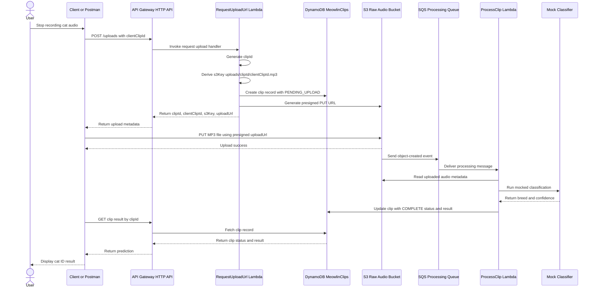

# Meowlin Architecture

Meowlin is a serverless AWS demo project inspired by the Merlin bird identification app, but focused on identifying likely cat breeds from recorded meows. The current project goal is to demonstrate practical AWS serverless architecture, not to implement production-grade machine learning.

The application should be built in small, working increments. The first milestone is a backend workflow that accepts a client-generated clip correlation ID, creates a server-side clip record, returns a presigned S3 upload URL, and eventually processes the uploaded audio asynchronously.

## Goals

- Demonstrate AWS serverless development skills.
- Keep the MVP simple, low-cost, and deployable with AWS SAM.
- Use realistic architecture boundaries so mocked behavior can be replaced later.
- Avoid overengineering while preserving a credible path to production.
- Use Postman as the temporary client instead of building a mobile app.

## Non-goals for MVP

- No real mobile app.
- No real machine learning model.
- No real cat breed/audio classifier.
- No Cognito authentication yet.
- No user history page yet.
- No multi-environment deployment yet.

## Current High-Level Architecture

```text
Postman / future client
  -> API Gateway HTTP API
  -> RequestUploadUrl Lambda
  -> DynamoDB MeowlinClips table
  -> S3 raw audio bucket via presigned PUT URL
  -> future SQS queue
  -> future ProcessClip Lambda
  -> future mocked classifier
  -> DynamoDB updated with results
```

## Primary Workflow: Request Upload and Store Clip Metadata

1. Client sends a request to `POST /uploads`.
2. Request body includes a client-generated correlation ID:

```json
{
  "clientClipId": "0000000002"
}
```

3. `RequestUploadUrlFunction` performs validation.
4. Lambda generates the authoritative server-side `clipId` using a UUID.
5. Lambda derives:

```text
fileName = {clientClipId}.mp3
s3Key = uploads/{clipId}/{clientClipId}.mp3
```

6. Lambda creates a DynamoDB item with status `PENDING_UPLOAD`.
7. Lambda generates a short-lived presigned S3 `PUT` URL.
8. Lambda returns upload metadata to the client.

Example response:

```json
{
  "clipId": "b0545f0f-b392-4be6-a6a8-e3f89c55a01b",
  "clientClipId": "0000000002",
  "clipStatus": "PENDING_UPLOAD",
  "s3Key": "uploads/b0545f0f-b392-4be6-a6a8-e3f89c55a01b/0000000002.mp3",
  "uploadUrl": "https://...",
  "uploadUrlExpiresInSeconds": 900
}
```

## Upload Workflow

The client uploads the MP3 file directly to S3 using the returned presigned URL.

For Postman:

```text
Method: PUT
URL: {{uploadUrl}}
Headers:
  Content-Type: audio/mpeg
Body:
  binary MP3 file
```

The audio file should not pass through API Gateway or Lambda. API Gateway and Lambda only coordinate metadata and presigned URL generation.

## Future Processing Workflow

After an object is uploaded to S3:

1. S3 emits an object-created event.
2. The event is sent to SQS.
3. `ProcessClipFunction` consumes the SQS message.
4. Lambda reads the associated clip metadata from DynamoDB.
5. Lambda runs a mocked classifier.
6. Lambda updates the clip record with mocked result fields.

Suggested result fields:

```text
clipStatus = COMPLETE | FAILED
identifiedBreed
confidenceScore
processedAt
```

## Mocking Strategy

The ML/classification layer is intentionally mocked. The goal is to build the cloud pipeline first and keep the classifier boundary replaceable.

Recommended mocked classifier behavior:

- Implement the classifier as a separate function/module, not inline business logic.
- Return one hardcoded or randomly selected cat breed result.
- Use plausible confidence scores.
- Optionally return a `NO_MEOW_DETECTED` style result later.

Example mocked results:

```json
[
  {
    "identifiedBreed": "Siamese",
    "confidenceScore": 0.92
  },
  {
    "identifiedBreed": "Maine Coon",
    "confidenceScore": 0.84
  },
  {
    "identifiedBreed": "Domestic Shorthair",
    "confidenceScore": 0.77
  }
]
```

Future replacement path:

```text
mockClassifier()
  -> real audio preprocessing
  -> spectrogram generation
  -> model inference
  -> ranked prediction results
```

The rest of the architecture should not need to change when the mock classifier is replaced.

## DynamoDB Design: MVP

Table name:

```text
MeowlinClips
```

Primary key:

```text
clipId : String
```

No sort key and no GSIs for MVP.

DynamoDB is schemaless except for keys and indexes. Do not add non-key attributes to `AttributeDefinitions` in CloudFormation/SAM.

Minimum item shape:

```json
{
  "clipId": "b0545f0f-b392-4be6-a6a8-e3f89c55a01b",
  "clientClipId": "0000000002",
  "clipStatus": "PENDING_UPLOAD",
  "createdAt": "2026-05-08T16:00:00.000Z",
  "s3Key": "uploads/b0545f0f-b392-4be6-a6a8-e3f89c55a01b/0000000002.mp3"
}
```

Future fields may include:

```text
processedAt
identifiedBreed
confidenceScore
errorMessage
userId
```

## Clip Status Values

Recommended lifecycle:

```text
PENDING_UPLOAD
UPLOADED
PROCESSING
COMPLETE
FAILED
```

For the current MVP, `PENDING_UPLOAD` is enough. Add additional statuses as the upload and processing steps become real.

## ID Strategy

- `clientClipId` is generated by the client and used for correlation/debugging.
- `clipId` is generated by Lambda and is the authoritative primary key.
- Use Node.js `crypto.randomUUID()` for `clipId`.
- Use a DynamoDB conditional write to avoid accidental overwrite:

```js
ConditionExpression: 'attribute_not_exists(clipId)'
```

DynamoDB does not auto-generate primary keys.

## Runtime and Language Choices

Recommended split:

- Node.js for API-oriented Lambda functions such as `RequestUploadUrlFunction`.
- Python later for `ProcessClipFunction`, since mocked or real classification/audio processing is a more natural fit for Python.

This split is intentional and should be documented as polyglot serverless design, not accidental inconsistency.

## SAM / Infrastructure Approach

- `template.yaml` is the source of truth for AWS resources.
- Deploy with SAM:

```powershell
sam build
sam deploy
```

- Test locally with:

```powershell
sam local start-api
```

- GitHub is source control only unless CI/CD is explicitly added later.
- SAM deploy uses local files, not the remote GitHub state.

## Cost and Abuse Controls

Current account-level Lambda concurrency appears to be low, around 10 concurrent executions. Do not set `ReservedConcurrentExecutions` in the SAM template unless the account quota is increased.

Recommended MVP controls:

- Keep the API URL private.
- Use API Gateway throttling.
- Use short-lived presigned URLs, such as 900 seconds.
- Validate request bodies early.
- Keep CloudWatch log retention short later.
- Add AWS Budgets alerts before sharing publicly.

Future public/demo controls:

- Cognito authentication.
- AWS WAF rate-based rules.
- More granular IAM permissions.
- S3 lifecycle expiration for uploaded demo audio.

## Current Sequence Diagram


