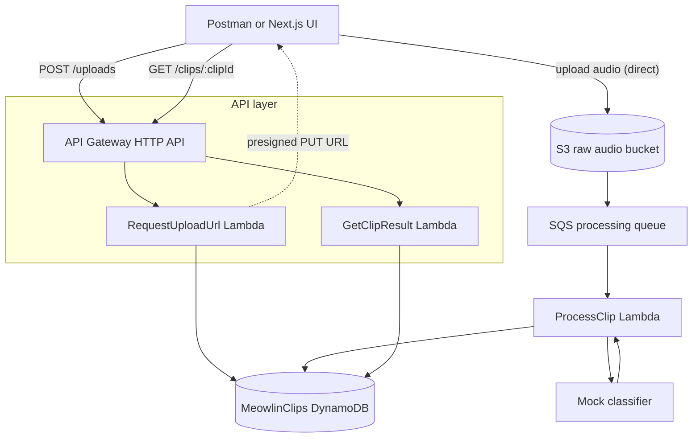
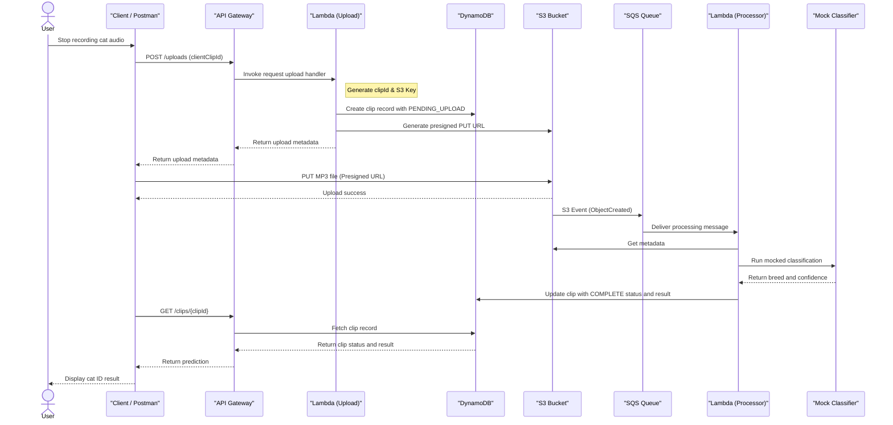

# Meowlin Architecture

Meowlin is a serverless AWS demo project inspired by the Merlin bird identification app, but focused on identifying likely cat breeds from recorded meows. The current project goal is to demonstrate practical AWS serverless architecture, not to implement production-grade machine learning.

The application should be built in small, working increments. The first milestone is a backend workflow that accepts a client-generated clip correlation ID, creates a server-side clip record, returns a presigned S3 upload URL, and eventually processes the uploaded audio asynchronously.

## Goals

- Demonstrate AWS serverless development skills.
- Keep the MVP simple, low-cost, and deployable with AWS SAM.
- Use realistic architecture boundaries so mocked behavior can be replaced later.
- Avoid overengineering while preserving a credible path to production.
- Use Postman as the temporary client instead of building a mobile app.

## Non-goals for MVP

- No real mobile app.
- No real machine learning model.
- No real cat breed/audio classifier.
- No Cognito authentication yet.
- No user history page yet.
- No multi-environment deployment yet.

## Current High-Level Architecture



For step-by-step timing, see [Current Sequence Diagram](#current-sequence-diagram).

## Primary Workflow: Request Upload and Store Clip Metadata

1. Client sends a request to `POST /uploads`.
2. Request body includes a client-generated correlation ID:

```json
{
	"clientClipId": "0000000002"
}
```

3. `RequestUploadUrlFunction` performs validation.
4. Lambda generates the authoritative server-side `clipId` using a UUID.
5. Lambda validates `contentType` (allowed audio MIME types), `fileSize` (max `MaxUploadSizeBytes`, default 10 MiB), and `fileName`.
6. Lambda derives:

```text
s3Key = uploads/{clipId}/{clientClipId}.{ext}
```

where `{ext}` comes from the client `fileName` (for example `.mp3`, `.wav`, `.webm`).

7. Lambda creates a DynamoDB item with status `PENDING_UPLOAD`.
8. Lambda generates a short-lived presigned S3 `PUT` URL signed for the normalized `Content-Type` (max size is enforced in `POST /uploads`, not on the presigned URL).
9. Lambda returns upload metadata to the client.

Example response:

```json
{
	"clipId": "b0545f0f-b392-4be6-a6a8-e3f89c55a01b",
	"clientClipId": "0000000002",
	"clipStatus": "PENDING_UPLOAD",
	"s3Key": "uploads/b0545f0f-b392-4be6-a6a8-e3f89c55a01b/0000000002.mp3",
	"uploadUrl": "https://...",
	"uploadUrlExpiresInSeconds": 900
}
```

## Upload Workflow

The client uploads the audio file directly to S3 using the returned presigned URL. The `PUT` body size must match the `fileSize` sent to `POST /uploads`.

For Postman:

```text
Method: PUT
URL: {{uploadUrl}}
Headers:
  Content-Type: (same as POST /uploads)
Body:
  binary audio file
```

The audio file should not pass through API Gateway or Lambda. API Gateway and Lambda only coordinate metadata and presigned URL generation.

## Future Processing Workflow

After an object is uploaded to S3:

1. S3 emits an object-created event.
2. The event is sent to SQS.
3. `ProcessClipFunction` consumes the SQS message.
4. Lambda reads the associated clip metadata from DynamoDB.
5. Lambda runs a mocked classifier.
6. Lambda updates the clip record with mocked result fields.

Suggested result fields:

```text
clipStatus = COMPLETE | FAILED
identifiedBreed
confidenceScore
processedAt
```

## Mocking Strategy

The ML/classification component is intentionally mocked for the sake of the demo, though its logic could be replaced with an actual classification scheme in the future.

### Example mocked results:

#### Breed identified

```json
{
	"clientClipId": "0000000053",
	"clipId": "09fc3ed3-dedf-4143-a35f-f44ff1d8912f",
	"clipStatus": "COMPLETE",
	"confidenceScore": 0.92,
	"createdAt": "2026-05-12T21:16:05.421Z",
	"identifiedBreed": "Siamese",
	"processedAt": "2026-05-12T21:16:08.990149+00:00",
	"s3Key": "uploads/09fc3ed3-dedf-4143-a35f-f44ff1d8912f/0000000053.mp3"
}
```

#### Breed NOT identified:

```json
{
	"clientClipId": "0000000056",
	"clipId": "4cb9bbf4-6fd8-4f3f-bd51-970e7bcd3502",
	"clipStatus": "COMPLETE",
	"confidenceScore": null,
	"createdAt": "2026-05-12T21:17:34.817Z",
	"identifiedBreed": null,
	"processedAt": "2026-05-12T21:17:39.563270+00:00",
	"s3Key": "uploads/4cb9bbf4-6fd8-4f3f-bd51-970e7bcd3502/0000000056.mp3"
}
```

The rest of the architecture should not need to change if/when the mock classifier is replaced.

## DynamoDB Design: MVP

Table name:

```text
MeowlinClips
```

Primary key:

```text
clipId : String
```

No sort key and no GSIs for MVP.

DynamoDB is schemaless except for keys and indexes. Do not add non-key attributes to `AttributeDefinitions` in CloudFormation/SAM.

Minimum item shape:

```json
{
	"clipId": "b0545f0f-b392-4be6-a6a8-e3f89c55a01b",
	"clientClipId": "0000000002",
	"clipStatus": "PENDING_UPLOAD",
	"createdAt": "2026-05-08T16:00:00.000Z",
	"s3Key": "uploads/b0545f0f-b392-4be6-a6a8-e3f89c55a01b/0000000002.mp3"
}
```

## Clip Status Values

Recommended lifecycle:

```text
PENDING_UPLOAD
UPLOADED
PROCESSING
COMPLETE
FAILED
```

## ID Strategy

- `clientClipId` is generated by the client and used for correlation/debugging.
- `clipId` is generated by Lambda using `crypto.randomUUID()` and is the authoritative primary key.
- conditional writes are used within DynamoDB to avoid accidental overwrite:

```js
ConditionExpression: "attribute_not_exists(clipId)"
```

## Source Layout

```text
src/api/
  request-upload-url/requestUploadUrl.js   # POST /uploads
  get-clip-result/getClipResult.js         # GET /clips/{clipId}
  process-clip/processClip.py              # SQS clip processor
src/front-end/                              # Next.js UI
```

## Runtime and Language Choices

- Node.js is used for API-oriented Lambda functions such as `RequestUploadUrlFunction`.
- Node.js could have also been used to implement the mocked `ProcessClipFunction`, but Python was chosen as it would be a better fit if real classification were added later.

## SAM / Infrastructure Approach

- `template.yaml` is the source of truth for AWS resources.
- The root `template.yaml` is the only source template. Files under `.aws-sam/build/` are generated artifacts and should not be edited directly.
- Deploy with SAM:

```powershell
sam build
sam deploy
```

- Test locally with:

```powershell
sam local start-api
```

- GitHub is source control only unless CI/CD is explicitly added later.
- SAM deploy uses local files, not the remote GitHub state.

## Environment Strategy (Current vs Future)

Current state:

- The project currently uses one deployed AWS stack/account.
- API stages (`dev`, `prod`) provide route/URL and workflow separation, not full infrastructure isolation.
- This is still useful for local-first testing and separate Postman environments.

What stage separation does now:

- Local `sam local start-api` should mirror stage URLs: `/dev/...` and `/prod/...` (same as deployed API Gateway).
- Supports cleaner client configuration (`/dev/uploads` vs `/prod/uploads`).
- Encourages safer release habits before adding full multi-stack environments.

What it does not do:

- It does not create separate DynamoDB tables, S3 buckets, IAM policies, or spend boundaries by itself.
- It does not provide true blast-radius isolation.

## Cost and Abuse Controls

Current account-level Lambda concurrency appears to be low, around 10 concurrent executions. Do not set `ReservedConcurrentExecutions` in the SAM template unless the account quota is increased.

Recommended MVP controls:

- Keep the API URL private.
- Use short-lived presigned URLs, such as 900 seconds.
- Validate request bodies early.
- Keep CloudWatch log retention short later.
- CloudWatch alarms and optional SNS + monthly cost budget are defined in `template.yaml` (see README **Monitoring and cost alerts**).

API throttling and rate limits (deployed):

- **Stage defaults** (`ApiStageThrottleRateLimit` / `ApiStageThrottleBurstLimit`): 50 r/s steady, 100 burst for all routes.
- **`POST /uploads`** (`ApiUploadThrottleRateLimit` / `ApiUploadThrottleBurstLimit`): 10 r/s steady, 20 burst (API Gateway returns `429`).
- **Per-IP WAF** (`WafUploadsRateLimitPerIp`): 100 `POST /uploads` requests per IP per 5-minute window minimum (AWS WAF floor); returns `403` when exceeded.
- **Per-IP WAF** (`WafClipsRateLimitPerIp`): 300 `GET /clips/*` requests per IP per 5-minute window by default (poll traffic).
- Regional Web ACL is associated with the `prod` stage.

CloudWatch alarms (deployed via SAM):

- API Gateway `4XXError` / `5XXError` on `meowlin-api` / `prod`
- WAF `BlockedRequests` (Web ACL aggregate)
- Lambda `Errors` for each function (`meowlin-request-upload-url`, `meowlin-get-clip-result`, `meowlin-process-clip`)
- S3 `NumberOfObjects` on the raw audio bucket (daily; threshold `AlarmS3ObjectCountThreshold`)
- Optional SNS email + monthly cost budget when `AlarmNotificationEmail` is set at deploy time

S3 upload retention (deployed):

- Objects under `uploads/` expire after **3 days** by default (`UploadObjectExpirationDays` in `template.yaml`, default 3).
- Incomplete multipart uploads under `uploads/` are aborted after **1 day**.
- DynamoDB clip rows are not deleted by this lifecycle rule.

Presigned upload limits (deployed):

- Max size **10 MiB** by default (`MaxUploadSizeBytes`).
- `contentType` must be an allowed audio MIME type (explicit list plus `audio/*`).
- `fileSize` is validated on `POST /uploads`; the client must send the same `Content-Type` on the presigned `PUT` as returned in the upload response.

CORS (deployed):

- `CorsAllowedOrigins` (`CommaDelimitedList` in `template.yaml`) configures S3 presigned `PUT`, Lambda response headers (`CORS_ALLOWED_ORIGINS`), and the default local origins (`http://localhost:3000`, `http://127.0.0.1:3000`).
- Add your GitHub Pages origin (e.g. `https://your-user.github.io`) when deploying for a public demo.
- API Gateway OPTIONS preflight uses `Allow-Origin: *`; Node Lambdas echo the request `Origin` only when it is on the allowlist (`src/api/cors.js`).

Possible future public/demo controls:

- Cognito authentication
- More granular IAM permissions
- DynamoDB TTL for orphaned clip metadata

## Current Sequence Diagram


