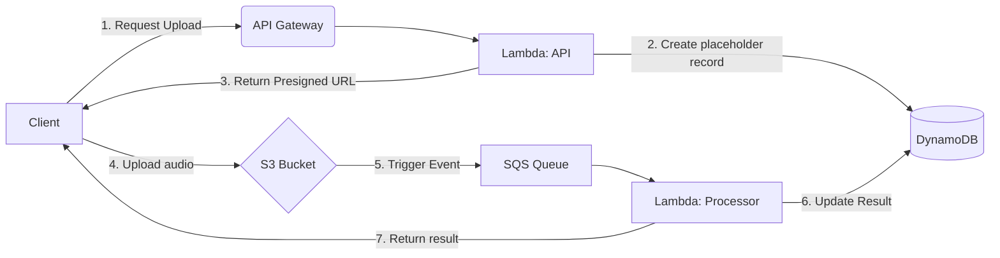

# Meowlin

Meowlin is a serverless AWS demo that simulates identifying cat breeds from uploaded meow audio. A React frontend talks to an API built with AWS SAM, API Gateway, Lambda, S3, SQS, and DynamoDB, which mock an asynchronous pipeline for ingesting clips and returning breed results.

> **NOTE**: Audio processing is mocked today. The classifier step could be replaced with a real machine-learning pipeline later.

## Purpose

I built this project for my portfolio to demonstrate the AWS serverless fundamentals listed in [Core Stack](#core-stack).

The live AWS stack and GitHub Pages site have been taken down to avoid ongoing charges. The source, SAM template, and local-run path remain so the architecture is still easy to inspect or rebuild.

## Watch a video of the demo

[Video walkthrough on YouTube](https://youtu.be/JFJGaR2UGt0)

In the recording you’ll see:

1. Choosing a short audio clip (10 MB max; common audio formats).
2. Upload progress completing.
3. The breed reveal (**Breed ID** and **Confidence** are mocked for this demo).

## Core Stack

| AWS Component                          | Description                                                             |
| :------------------------------------- | :---------------------------------------------------------------------- |
| **Serverless Application Model (SAM)** | Infrastructure management                                               |
| **API Gateway**                        | REST API                                                                |
| **Lambda**                             | Serverless functions (Node.js 22.x for API, Python 3.12 for Processing) |
| **S3**                                 | Raw audio storage (uploads expire after 3 days by default)              |
| **DynamoDB**                           | Persistence of metadata and results                                     |
| **SQS**                                | Messaging to support asynchronous processing                            |

## Inspiration

The overall solution was inspired by the [Merlin](https://merlin.allaboutbirds.org/) bird identification app, though the front end takes its cues from the [Who's That Pokémon?](https://bulbapedia.bulbagarden.net/wiki/Who%27s_That_Pok%C3%A9mon%3F#) segment of [_Pokémon the Series_](https://bulbapedia.bulbagarden.net/wiki/Pok%C3%A9mon_the_Series).

## Prerequisites

To run or redeploy locally, ensure you have:

- **[AWS SAM CLI](https://docs.aws.amazon.com/serverless-application-model/latest/developerguide/install-sam-cli.html)**: Used for building and local emulation
- **[Docker Desktop](https://docs.docker.com/desktop/)**: Required by SAM to run Lambda functions in a local container environment
- **[Node.js 22.x](https://nodejs.org/en/download)**: Required to build the API Lambda functions
- **[Python 3.12](https://www.python.org/downloads/release/python-3120/)**: Required to build the processing/classifier Lambda functions
- **[AWS CLI](https://aws.amazon.com/cli/)**: Configured with credentials if you intend to deploy or interact with live AWS resources

## Quick Start (local)

There is no hosted API. Use SAM local emulation (and optionally the Next.js app against that API).

1. **Clone the repo**:
   ```powershell
   git clone https://github.com/jtasse/meowlin.git
   ```
2. **Build the project**:
   ```powershell
   sam build
   ```
3. **Run the API locally**:
   ```powershell
   sam local start-api
   ```
4. **Test with Postman**:
   - Import the collection and environment from the `postman/` directory.

## Tests

Backend unit tests cover the API Lambdas and clip processor (mocked AWS clients; no live stack required):

```powershell
npm install
npm test
```

- **Node (Jest):** `src/api/cors.test.js`, `request-upload-url/requestUploadUrl.test.js`, `get-clip-result/getClipResult.test.js`
- **Python (pytest):** `src/api/process-clip/test_processClip.py` — install dev deps once with `pip install -r src/api/process-clip/requirements-dev.txt`
- **Front-end (Vitest):** `src/front-end/lib/*.test.ts` — from `src/front-end`, run `npm install` then `npm test`

Run subsets with `npm run test:api`, `npm run test:process-clip`, or `npm run test:front-end`.

## Frontend

The Next.js frontend lives in `src/front-end`.

To run it locally:

```powershell
cd src/front-end
npm install
npm run dev
```

Then open `http://localhost:3000`.

Point `NEXT_PUBLIC_API_BASE_URL` at your local SAM API (see `.env.example`) when exercising uploads end-to-end.

### Static export (optional)

The UI supports static export (`output: "export"` in `next.config.ts`). GitHub Pages hosting used for the public demo has been disabled. The workflow under [`.github/workflows/pages.yml`](.github/workflows/pages.yml) is kept for reference and can be run manually if you stand the API back up and re-enable Pages.

## Redeploying to AWS (optional)

`template.yaml` and `samconfig.toml` are IaC only — they do not incur charges while undeployed. To recreate the stack:

```powershell
sam build
sam deploy
```

`samconfig.toml` expects packaging bucket `jtj-meowlin-raw-audio` (same name as the former raw-audio bucket). Create that bucket first, or change `s3_bucket` / enable `resolve_s3` before deploying.

When hosting a UI elsewhere, include its origin in CORS:

```powershell
sam deploy --parameter-overrides CorsAllowedOrigins="http://localhost:3000,https://your-user.github.io"
```

Useful parameters (see `template.yaml`):

- `UploadObjectExpirationDays` — S3 lifecycle for `uploads/` (default 3 days; incomplete multipart aborted after 1 day)
- `MaxUploadSizeBytes` — presigned upload cap (default 10 MiB)
- `ApiUploadThrottle*`, `WafUploadsRateLimitPerIp`, `WafClipsRateLimitPerIp` — API Gateway and WAF limits
- `AlarmNotificationEmail`, `MonthlyBudgetLimitUsd` — CloudWatch alarm email + monthly budget (confirm the SNS subscription after deploy)

## Caveats

- Although the Merlin bird ID app performs audio processing in the client on the mobile device; for this demo I have shifted this work into AWS.
- This solution relies on mock data. To truly ID cats based on their meows, it would need:
  - a robust machine learning algorithm
  - a significant collection of high quality meow data
- Authentication is intentionally omitted from the MVP to keep the demo focused on serverless ingestion and processing. A production version would use Cognito/JWT authorization to associate clips with users and protect history endpoints.

## High-Level Data Flow

The following diagram illustrates how data moves through the system from the initial request to the final processed result:



> **NOTE**: For the full architecture diagram and a detailed sequence diagram, see [ARCHITECTURE.md](./ARCHITECTURE.md#current-high-level-architecture).

## Attributions
| Asset                            | Description                                                               |
| :---------------------------------- | :------------------------------------------------------------------------ |
| [Who's That Pokemon?](https://bulbapedia.bulbagarden.net/wiki/Who%27s_That_Pok%C3%A9mon%3F)  | Article explaining the history of "Who's That Pokemon?" |
| [Who's That Pokemon Templates](https://biochao.gumroad.com/l/qaoas?_gl=1*13d87r7*_ga*MTI1OTYxMTYzLjE3Nzk0NjM2MjQ.*_ga_6LJN6D94N6*czE3Nzk1NTQ2NzEkbzIkZzEkdDE3Nzk1NTYyMTUkajYwJGwwJGgw) | Fantastic animations and other assets that honor the spirit of "Who's That Pokemon?") |
| [Maine Coon](https://www.zooplus.co.uk/magazine/wp-content/uploads/2019/03/maine-coon-cat-breed-768x658.webp) | Image of a Maine Coon cat |
| [Siamese](https://www.cozycatfurniture.com/image/siamese-cat-cover.jpg) | Image of a Siamese cat |
| [American Shorthair](https://consumer-cms.petfinder.com/sites/default/files/images/content/American%20Shorthair%20Cat%202.jpg) | Image of an American Shorthair cat |
| [Mystery cat](https://www.vecteezy.com/vector-art/29900485-mysterious-cat-silhouette-or-vector) | Myster cat/silhouette image |

## See Also

| Document                            | Description                                                               |
| :---------------------------------- | :------------------------------------------------------------------------ |
| [ARCHITECTURE.md](ARCHITECTURE.md)  | Technical overview of the system design, sequence diagrams, and data flow |
| [CONTRIBUTING.md](CONTRIBUTING.md)  | Guidelines for developers, coding standards, and project scope            |
| [Postman README](postman/README.md) | Setup and usage instructions for the Postman collection and environments  |
