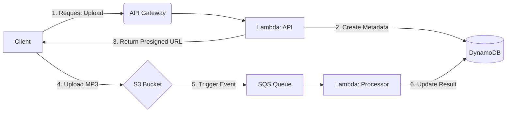

# Meowlin

Meowlin is a serverless AWS demo application inspired by the [Merlin](https://merlin.allaboutbirds.org/) bird identification app. Meowlin provides a cloud-native pipeline that ingests audio clips and \*_simulates_ processing them asynchronously to determine if any meows and corresponding cat breeds can be identified.

> **\*NOTE**: although Meowlin currently mocks the processing of audio clips, this simulated component _could_ be replaced with true machine learning + processing solution in the future.

## Purpose

I have created this project for my portfolio in order to demonstrate AWS serverless fundamentals listed in the [Core Stack](#core-stack) below.

## Core Stack

| AWS Component                          | Description                                                             |
| :------------------------------------- | :---------------------------------------------------------------------- |
| **Serverless Application Model (SAM)** | Infrastructure management                                               |
| **API Gateway**                        | REST API                                                                |
| **Lambda**                             | Serverless functions (Node.js 20.x for API, Python 3.12 for Processing) |
| **S3**                                 | Raw audio storage                                                       |
| **DynamoDB**                           | Persistentence of metadata and results                                  |
| **SQS**                                | Messaging to support asynchronous processing                            |

## Prerequisites

Before running the commands below, ensure you have the following installed:

- **[AWS SAM CLI](https://docs.aws.amazon.com/serverless-application-model/latest/developerguide/install-sam-cli.html)**: Used for building and local emulation. [Install Guide]
- **[Docker Desktop](https://docs.docker.com/desktop/)**: Required by SAM to run Lambda functions in a local container environment
- **[Node.js 20.x](https://nodejs.org/en/download)**: Required to build the API Lambda functions
- **[Python 3.12](https://www.python.org/downloads/release/python-3120/)**: Required to build the processing/classifier Lambda functions
- **[AWS CLI](https://aws.amazon.com/cli/)**: Configured with credentials if you intend to deploy or interact with live AWS resources

## Quick Start

1. **Build the project**:
   ```powershell
   sam build
   ```
2. **Run locally**:
   ```powershell
   sam local start-api
   ```
3. **Test with Postman**:
   Import the collection and environment from the `postman/` directory.

# Caveats

- Although the Merlin bird ID app performs audio processing in the client on the mobile device; for this demo I have shifted this work into AWS.
- This solution relies on mock data. To truly ID cats based on their meows, it would need:
  - a robust machine learning algorithm
  - a significant collection of high quality meow data
- Authentication is intentionally omitted from the MVP to keep the demo focused on serverless ingestion and processing. A production version would use Cognito/JWT authorization to associate clips with users and protect history endpoints.

## High-Level Data Flow

The following diagram illustrates how data moves through the system from the initial request to the final processed result:



> **NOTE**: to view a sequence digram showin the process in more detail, see [ARCHITECTURE.md](./ARCHITECTURE.md#current-sequence-diagram).

## See Also

| Document                            | Description                                                               |
| :---------------------------------- | :------------------------------------------------------------------------ |
| [ARCHITECTURE.md](ARCHITECTURE.md)  | Technical overview of the system design, sequence diagrams, and data flow |
| [CONTRIBUTING.md](CONTRIBUTING.md)  | Guidelines for developers, coding standards, and project scope            |
| [Postman README](postman/README.md) | Setup and usage instructions for the Postman collection and environments  |
