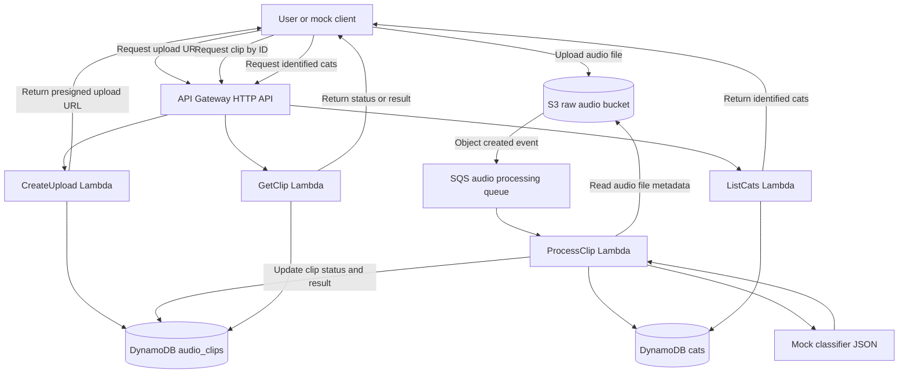

```mermaid
flowchart TD
A["User or mock client"] -->|"Request upload URL"| B["API Gateway HTTP API"]
B --> C["CreateUpload Lambda"]
C --> D[("DynamoDB audio_clips")]
C -->|"Return presigned upload URL"| A

    A -->|"Upload audio file"| E[("S3 raw audio bucket")]

    E -->|"Object created event"| F["SQS audio processing queue"]
    F --> G["ProcessClip Lambda"]

    G -->|"Read audio file metadata"| E
    G --> H["Mock classifier JSON"]
    H --> G

    G -->|"Update clip status and result"| D
    G --> I[("DynamoDB cats")]

    A -->|"Request clip by ID"| B
    B --> J["GetClip Lambda"]
    J --> D
    J -->|"Return status or result"| A

    A -->|"Request identified cats"| B
    B --> K["ListCats Lambda"]
    K --> I
    K -->|"Return identified cats"| A
```
