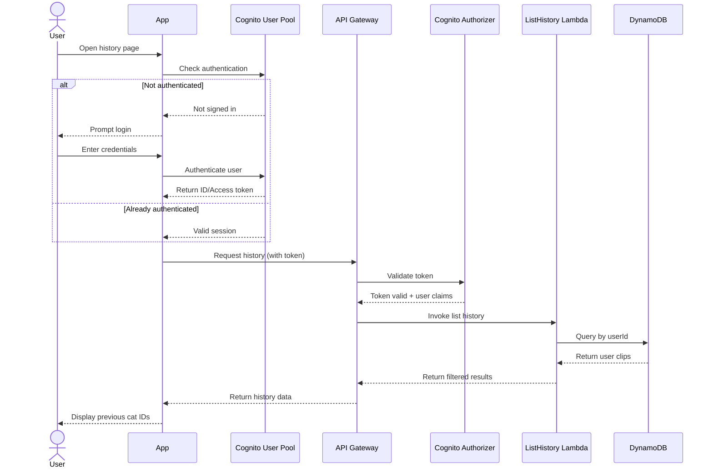

```mermaid
sequenceDiagram
    actor User
    participant App
    participant Cognito as Cognito User Pool
    participant API as API Gateway
    participant Auth as Cognito Authorizer
    participant Lambda as ListHistory Lambda
    participant DB as DynamoDB

    User->>App: Open history page
    App->>Cognito: Check authentication

    alt Not authenticated
        Cognito-->>App: Not signed in
        App-->>User: Prompt login
        User->>App: Enter credentials
        App->>Cognito: Authenticate user
        Cognito-->>App: Return ID/Access token
    else Already authenticated
        Cognito-->>App: Valid session
    end

    App->>API: Request history (with token)
    API->>Auth: Validate token
    Auth-->>API: Token valid + user claims

    API->>Lambda: Invoke list history
    Lambda->>DB: Query by userId
    DB-->>Lambda: Return user clips

    Lambda-->>API: Return filtered results
    API-->>App: Return history data
    App-->>User: Display previous cat IDs
```
