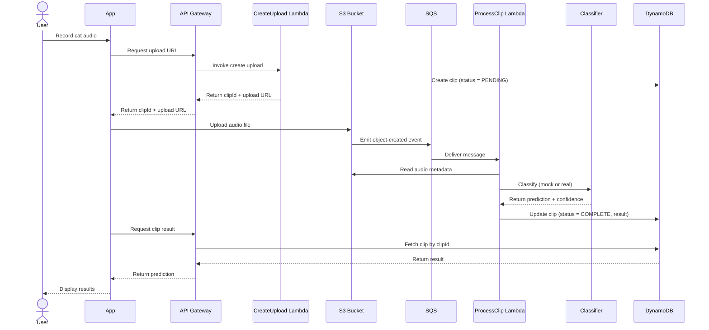

```mermaid
sequenceDiagram
    actor User
    participant App
    participant API as API Gateway
    participant Upload as CreateUpload Lambda
    participant S3 as S3 Bucket
    participant Queue as SQS
    participant Processor as ProcessClip Lambda
    participant Classifier
    participant DB as DynamoDB

    User->>App: Record cat audio
    App->>API: Request upload URL
    API->>Upload: Invoke create upload
    Upload->>DB: Create clip (status = PENDING)
    Upload-->>API: Return clipId + upload URL
    API-->>App: Return clipId + upload URL

    App->>S3: Upload audio file
    S3->>Queue: Emit object-created event
    Queue->>Processor: Deliver message

    Processor->>S3: Read audio metadata
    Processor->>Classifier: Classify (mock or real)
    Classifier-->>Processor: Return prediction + confidence

    Processor->>DB: Update clip (status = COMPLETE, result)

    App->>API: Request clip result
    API->>DB: Fetch clip by clipId
    DB-->>API: Return result
    API-->>App: Return prediction
    App-->>User: Display results
```
