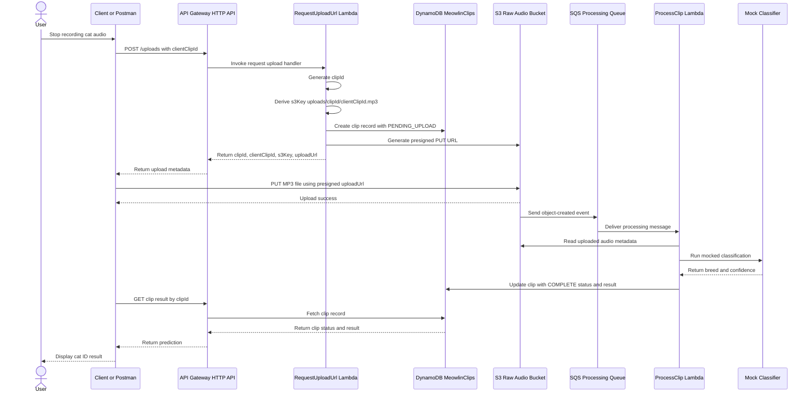

```mermaid
sequenceDiagram
actor User
participant Client as Client or Postman
participant API as API Gateway HTTP API
participant Upload as RequestUploadUrl Lambda
participant DB as DynamoDB MeowlinClips
participant S3 as S3 Raw Audio Bucket
participant Queue as SQS Processing Queue
participant Processor as ProcessClip Lambda
participant Classifier as Mock Classifier

    User->>Client: Stop recording cat audio
    Client->>API: POST /uploads with clientClipId
    API->>Upload: Invoke request upload handler

    Upload->>Upload: Generate clipId
    Upload->>Upload: Derive s3Key uploads/clipId/clientClipId.mp3
    Upload->>DB: Create clip record with PENDING_UPLOAD
    Upload->>S3: Generate presigned PUT URL

    Upload-->>API: Return clipId, clientClipId, s3Key, uploadUrl
    API-->>Client: Return upload metadata

    Client->>S3: PUT MP3 file using presigned uploadUrl
    S3-->>Client: Upload success

    S3->>Queue: Send object-created event
    Queue->>Processor: Deliver processing message

    Processor->>S3: Read uploaded audio metadata
    Processor->>Classifier: Run mocked classification
    Classifier-->>Processor: Return breed and confidence

    Processor->>DB: Update clip with COMPLETE status and result

    Client->>API: GET clip result by clipId
    API->>DB: Fetch clip record
    DB-->>API: Return clip status and result
    API-->>Client: Return prediction
    Client-->>User: Display cat ID result
```
